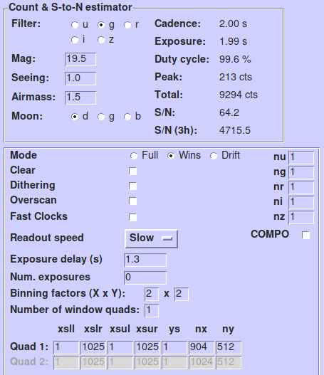

.. Links to checklists 21/06/2018

.. include:: globals.rst

Defining high-speed set ups
***************************

Perhaps the most crucial part of any observation is configuring the
instrument. Decisions you make here are irrevocable and can make a
big difference to data quality. This is certainly the case for
observations with |hiper|, ULTRACAM and ULTRASPEC, and, especially if
you have not observed with them directly, it can be hard to make the
right decisions. This page tries to get over some of the things to
think about. A crucial role is played by Stu Littlefair's finding
chart software, "hfinder", "ufinder" and "usfinder". You are
*strongly* advised to get these going to understand elements of this
page better. The two key points from this page are:

* Understand the meaning of "S/N (3h)" in hdriver, udriver and usdriver,
  and devise your setup to optimise it within any other constraints (timing,
  spatial resolution) on your programme

* Use as large an exposure time and binning factor as you can whilst avoiding
  saturation, or undersampling in time or spatially.

Here I look at some examples of high speed obervations.

Timescales
----------

The first thing you should decide is what cadence and/or exposure time
do you need. Cadence here is defined as the time between successive
mid-exposure times, while the exposure is the time actually collecting
photons per exposure. By definition, the exposure time is always less
than the cadence, although in many instances, due to the way the
cameras were designed, they can be very close. e.g. one can take
sequence of 2 second cadence observations, collecting photons 98% of
the time.

These time-scales will be set by your science. They may in some case drive you
into difficult territory instrumental setup-wise, but they are non-negotiable.

Saturation
----------

You may have the luxury of quite a long timescale and yet a bright
object, 20 seconds say on a V=14 star. Then you need to worry about
saturation. Perhaps you will need to use 2 second exposures just to
avoid saturation. There is a strong trade-off with binning in this
case.  Changing from 1x1 to 2x2 binning increases the counts at peak
by a factor 4. Saturation is however one of the things that any
competent observer will be on the look-out for, and is in any case
hard to plan for in advance because of different seeing values. Your job then
should be to plan for this in one or both of two ways:

#. Build some slack into your setup so that the exposure time can easily
   be reduced. The point here is that some setup may have exposure times
   entirely set by the window size, with no room for change. If this suffers
   saturation, the observers only choices might be to re-configure entirely or
   attempt the second method. If there is some headroom, then it is
   trivial to stop a run and re-start with a reduced exposure.

#. Defocus. This is beloved of those who observe exoplanets, or rather their
   host stars, which tend to be very bright and are able to withstand large
   FWHM without much ill effect. You would need to let the observer know if
   this is your preferred method of coping with saturation.

Readout noise
-------------

At the opposite end of the scale, but very often an important
consideration is readout noise. A key equation to remember is the
following for the uncertainty in counts of an object extracted using
aperture photometry from a CCD:

.. math::

   \sigma = \sqrt{n R^2 + \frac{S + C}{G}},

where *R* is the RMS readout noise in counts (ADU) per pixel, *n* is
the number of pixels in the aperture, *S* is the total number of
counts from the sky within the aperture, *C* is the total number of
counts from the object within the aperture and *G* is the CCD gain
measured here in terms of electrons per ADU. You have no control over
*C* and several others of the variables here, but there are important
aspects that you certainly can control.

First of all is *n*:, the number of pixels: you have a huge influence
over this through binning and this can be make-or-break in terms of
data quality. Here is an example from |hiper| where I assume *R = 4*
*G = 1.2*, and an unbinned pixel size of 0.081 arcsecond. So let's
assume I observe a *g = 21* magnitude star in 1 arcsecond seeing for 1
second. |hiper|'s zeropoint in *g* is 29.25 (above the atmosphere).
Allowing a bit of atmosphere leads to a total of around 1600 counts in
one second.  Not all would fall into the aperture, `hfinder` returns
1171 counts, but ignoring sky background for the moment, one might be
hoping for a signal-to-noise ratio of order 30.  However, what about
readout? A good choice for the aperture radius is around 1.8x the FWHM
of the seeing, i.e. 1.8 arsec it this case of *r = 22.2* unbinned
pixels. Thus :math:`n = \pi r^2 = 1551`. Thus the :math:`n R^2` term
above works out at a whopping 25,000 compared to :math:`C/G \approx
1000`. In other words we are completely readout-noise dominated
(although to be fair we have not allowed for the sky background term
*S*).  `hfinder` actually returns a signal-to-noise of 7.4 in this
case (including sky).

The second element we have control over is the exposure time, within
the parameters set by the instrument and the need to avoid saturation. The exposure time controls *S* and *C*, so that longer exposures are always less affected by read noise. Hence we can improve things by one or both of the following:

#. Increase the exposure time. Perhaps we chose 1 second to be sure of
   avoiding saturation, whereas we can in fact cope with 10
   seconds. That would boost both *S* and *C* by a factor of 10 but
   *n* would stay the same. Equivalently we have cut the number of
   readouts by a factor of 10. The improvement would be enormous.

#. Change the binning! With |hiper|'s small pixels particularly, this
   is almost always a good idea. Switching to 4x4 (0.32" pixels) cuts
   *n* by a factor of 16. The signal to noise returned by `hfinder`
   becomes 15.1 in this case. That's the equivalent of increasing the
   exposure time by :math:`(15.1/7.4)^2`, i.e. by a factor of 4(!),
   even though the actual exposure time is still 1 second).

Seeing-robust setups
--------------------

The readout noise / binning / exposure time "virtuous triangle" is
critically important, even more so if your programme might be
carried out in poor seeing. You might be worried about saturation
during good seeing, but at the same time should think about readout
noise during bad seeing. Especially if your programme is going to be
carried out through OBs, the duty astronomer is likely to carry it out
as you request and so it's up to you to design a setup that works as
well as possible across the likely range of conditions. the best way
to go about this is through the use of the finding chart tools
hfinder, ufinder and usfinder, so I am now going to go through some
case studies based upon hfinder for |hiper|.

Case study 1: *g = 19.5*
------------------------

Aim: I want to observe a star with *g = 19.5* with at worst a 10 second cadence.
I will assume dark time, and 1.0" seeing.

1x1 binning
-----------

Starting with 1x1 binning, and wanting to take no risks with the
timescale, I go for a 2 second cadence. I have to trim the widows a
bit, but it is straighforwardly achievable. The relevant part of
`hfinder` is as follows

.. image:: hfinder-1.png
  :width: 400
  :alt: Section of hfinder window

The two key numbers here are (i) the peak counts (54 counts), and (ii)
the "S/N (3h)" = 3576, representing the (theoretical) signal-to-noise
I could achieve if I observed like this for 3 hours.  The first number
says that I am no where near saturation, and that I above
readout-squared, although not by a huge amount perhaps. The second
number is how I can compare like-for-like between different setups.
Obviously a longer exposure will give a better signal-to-noise in one
exposure ("S/N" in `hfinder`), but with fewer overall exposures,
it won't be so much better in a fixed time, so the signal-to-noise
in 3 hours is the number to use for comparing setups.

Now let's try 2x2 binning.

2x2 binning
-----------

Again we will try for a 2 second cadence in dark time. After fiddling
with windows to get precisely 2 seconds, I find

The peak counts are now 213, reflecting the factor of 4 fewer pixels,
still well below saturation and significantly better compared to the
readout noise squared. This is reflected in the S/n (3h) which is
now 4716.  This is a significant improvement: I would need to observe
:math:`(4716/3576)^2 = 1.74` times longer with 1x1 binning than with
2x2 binning to achieve the same outsome in terms of overall
signal-to-noise ratio. Put differently, observing with 1x1 is like
observing with 2x2 but then throwing away 40% of the data.

Larger binning, different exposures
-----------------------------------

Here is a table for different binning factors and two different
exposure times. The difference from best to worst is equivalent
to a factor :math:`(5418/3576)^2 = 2.3` in effective extra
exposure time, for exactly the same duration observation.

.. list-table:: hdriver: g=19.5, dark time, 1.0" seeing
   :widths: 18 20 22 20
   :header-rows: 1

   * - Binning
     - Cadence
     - S/N (3 h)
     - Peak
   * - 1x1
     - 2.0
     - 3576
     - 54
   * - 2x2
     - 2.0
     - 4716
     - 213
   * - 3x3
     - 2.0
     - 5075
     - 471
   * - 4x4
     - 2.0
     - 5221
     - 818
   * - 5x5
     - 2.0
     - 5294
     - 1250
   * - 6x6
     - 2.0
     - 5333
     - 1740
   * - 1x1
     - 10.0
     - 4841
     - 269
   * - 2x2
     - 10.0
     - 5268
     - 1070
   * - 3x3
     - 10.0
     - 5360
     - 2369
   * - 4x4
     - 10.0
     - 5394
     - 4134
   * - 5x5
     - 10.0
     - 5409
     - 6273
   * - 6x6
     - 10.0
     - 5418
     - 8725

Note that the crucial "S/N (3h)" value does saturate, i.e. one reaches
a point where gains are fairly limited. This is nice behaviour in that
it means as long as one is in this regime, the exact setup does not
matter too much. This is what one should be aiming for.

6x6 binning implies 0.5" pixels. Much larger than this is possible, but
you will be undersampling the profiles, and gaining not so much. Also,
large pixels increase pixellation effects which can add some noise.

Now an important test: how robust are these setup to poor conditions? Let's try 3" seeing.
The table becomes

.. list-table:: hdriver: g=19.5, dark time, 3.0" seeing
   :widths: 18 20 22 20
   :header-rows: 1

   * - Binning
     - Cadence
     - S/N (3 h)
     - Peak
   * - 1x1
     - 2.0
     - 1338
     - 6
   * - 2x2
     - 2.0
     - 1962
     - 24
   * - 3x3
     - 2.0
     - 2211
     - 54
   * - 4x4
     - 2.0
     - 2324
     - 95
   * - 5x5
     - 2.0
     - 2383
     - 148
   * - 6x6
     - 2.0
     - 2416
     - 212

   * - 1x1
     - 10.0
     - 2044
     - 30
   * - 2x2
     - 10.0
     - 2360
     - 120
   * - 3x3
     - 10.0
     - 2435
     - 269
   * - 4x4
     - 10.0
     - 2464
     - 477
   * - 5x5
     - 10.0
     - 2477
     - 743
   * - 6x6
     - 10.0
     - 2485
     - 1066

There is an inevitable hit from poor seeing, even with zero readout
noise, because of the sky background; the level of this is very
dependent upon the brightness of our target. There is little you can
do about this, beyond waiting for better conditions. The important
point to take from this is which setups perform best as the seeing
changes from 1 to 3".  This is what I mean by "seeing robust". We can
see that not only is the unbinned short exposure setup the worst in
the first place, but it get even worse in bad seeing.  The table below
shows these as a ratio of "effective exposure time".

.. list-table:: Impact of seeing changing from 1.0 to 3.0", *g = 19.5*.
   :widths: 33 33 33
   :header-rows: 1

   * - Binning
     - Cadence
     - Ratio
   * - 1x1
     - 2.0
     - 0.14
   * - 2x2
     - 2.0
     - 0.17
   * - 3x3
     - 2.0
     - 0.19
   * - 4x4
     - 2.0
     - 0.20
   * - 5x5
     - 2.0
     - 0.20
   * - 6x6
     - 2.0
     - 0.21

   * - 1x1
     - 10.0
     - 0.18
   * - 2x2
     - 10.0
     - 0.20
   * - 3x3
     - 10.0
     - 0.21
   * - 4x4
     - 10.0
     - 0.21
   * - 5x5
     - 10.0
     - 0.21
   * - 6x6
     - 10.0
     - 0.21

Of course the deterioration in this case is large enough that one
probably needs to set an upper limit to the seeing that is less than
3".

Case study 2: *g = 15.0*
------------------------

Here I want to go much faster on a brighter star with *g = 15.0*.
I will consider cadences of 0.1 and 1 seconds, and just look at the final table.

.. list-table:: Impact of seeing changing from 1.0 to 3.0", *g = 15.0*.
   :widths: 33 33 33
   :header-rows: 1

   * - Binning
     - Cadence
     - Ratio

   * - 1x1
     - 0.1
     - 0.21

   * - 2x2
     - 0.1
     - 0.41

   * - 3x3
     - 0.1
     - 0.57

   * - 4x4
     - 0.1
     - 0.67

   * - 5x5
     - 0.1
     - 0.74

   * - 6x6
     - 0.2
     - 0.78

   * - 1x1
     - 1.0
     - 0.60

   * - 2x2
     - 1.0
     - 0.80

   * - 3x3
     - 1.0
     - 0.85

   * - 4x4
     - 1.0
     - 0.87

   * - 5x5
     - 1.0
     - 0.88

   * - 6x6
     - 2.0
     - 0.89

Possibly surprisingly, the worst setup here behaves even more poorly
in terms of the change than bfore. This is because the sky has
relatively little effect, whereas as before it tended to equalise
things a bit and make read noise less important. Here, 1x1 binning and
0.1 second exposure incurrs a very heavy readout noise penalty. The
6x6, 1 second, 1.0 arcsecond case here is close to "Poisson limited"
(but also to saturation in fact, so it is really pushing things a
bit). By contrast 1x1, 0.1 seconds, 3.0 arcsecond seeing has only 11%
of the effective exposure time, even though more-or-less the same
number of counts would be recorded in 3 hours.

So, to repeat myself, for high-speed obervations:

* Work out the longest cadence your science can withstand, bearing in
  mind saturation

* Similarly work out the largest binning factor you can use.

* Starting from these optimise for maximal "S/N (3 hr)"

* If you anywhere in the vicinity of saturation (e.g. > 10,000 at
  peak) such that exceptional seeing might cause saturation, build in
  headroom within your setup for the observer to reduce the exposure
  time if necessary.

Tricks to pushing the limits
-----------------------------

If you want to go fast, you will probably need to window. Basically
each pixel that you readout takes some time, so if you cut them, you
speed things. That can be through binning and/or windowing.

A basic 1x1 full frame image with slow readout takes 2.88 seconds to
read out.  Binning 2x2 drops that to 0.766 sec, 4x4 to 0.222 sec, 8x8
to 0.0772, and with some small windows you can cut that to below
0.02. That's in two window mode. If you switch to "drift", you can get
sub 0.01 seconds, and with "fast clocks" binning 16x16 with two 64x64
(before binning) windows, below 0.005 seconds, all at high efficiency
(> 70%). The shortest exposure times in such cases are around 0.0025
seconds. Note here that binning is crucial not only in reducing
readout noise but also readout time. If you switch back to 1x1, the
exposure time becomes gets over 10 times longer but the S/N (3hr) may
drop, i.e. both worse S-to-N and worse time resolution.

If you have to go much faster than this, then you may want to switch
back to windows mode plus clear, While this is slower in terms of
cadence, it allows much shorter exposure times, at the price of
inefficiency because this is one case where cadence greatly exceeds
the exposure.

