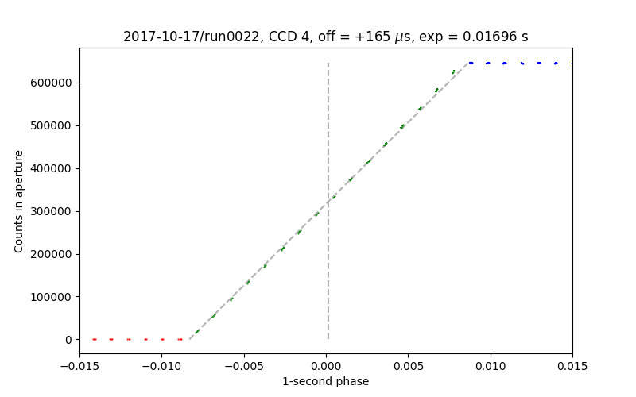

.. documentation of HiPERCAM timing tests

.. include:: ../globals.rst

.. |fig-0022-4| replace:: :numref:`fig-0022-4`

.. |fig-0022-5| replace:: :numref:`fig-0022-5`

Timing tests
************

To test the relations derived in :doc:`timing`, we rigged up an LED
pseudo-star on the focal plane mask. The LED turns on precisely and
near-instantaneously at the start of each UTC second (and off again about half
a second later). If one takes a series of short exposures (< 0.5 seconds),
then depending upon how they align with the square wave from the LED, one gets
either no counts, a steady maximum number of counts or something in between.
The data were extracted using |reduce|, and then plotted after folding on
the period of 1 second with an exact integer zero point. The data fold to give
either no counts, the full number of counts, and a linear ramp in between of
duration equal to the time spent accumulating photons. If the timing code
is correct, the mid-point of the ramp should coincide with zero, and any
offset gives an estimate of the precision to which times from |hiper|
can be trusted.

WHT commissioning run, 2017-10-22, run0022
==========================================

This was a no-clear windowed mode run from the first commissioning run on the
WHT in October 2017. |fig-0022-4| and |fig-0022-5| shows the test data for
CCDs 4 and 5 (the others were either not operative or saturated).

.. _fig-0022-4:

   Timing test data for CCD 4, run0022 of 2017-10-22 shows a +165 microsecond
   offset. There are clear signs of non-linearity in the 'ramp' and the
   readout was known to exhibit significant non-linearity in this run that
   was subsequently fixed.

.. _fig-0022-5:

.. figure:: 2017-10-22-0022-5.png
   :scale: 100 %
   :alt: timing test data for CCD5, run0022 of 2017-10-22

   Timing test data for CCD 5, run0022 of 2017-10-22 shows a -1 microsecond
   offset. The count levels are much lower in this arm, and non-linearity
   appears less than in CCD 4.

For this mode and run at least, the timing looks pretty good, albeit limited
by the unknown effects of non-linearity.
